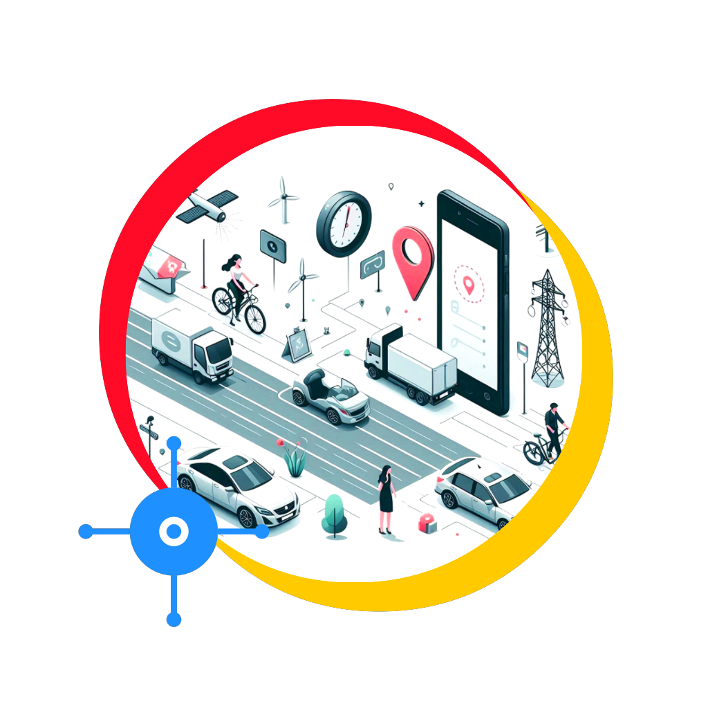
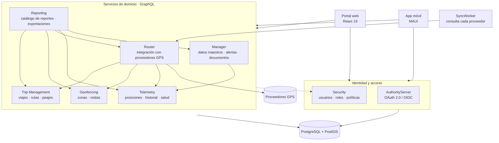

<div align="center">


# TrackHub

**Un solo lugar para toda la flota, sin importar en qué plataforma GPS esté cada vehículo.**

[English](README.md) · [Español](README.es.md)

[](LICENSE)
[](global.json)
[](TrackHub.Portal)
[](TrackHub.Deployment/QUICKSTART.md)
[](https://github.com/shernandezp/TrackHub/actions/workflows/ci.yml)



</div>

---

## Qué es TrackHub

La mayoría de las organizaciones no compra su hardware GPS a un solo proveedor: lo hereda — un lote
de rastreadores de un proveedor, una segunda plataforma que llegó con una flota arrendada, una
tercera que ya pagaba una filial. Cada una trae su propio portal, su propio inicio de sesión y su
propia idea de qué es un "viaje".

**TrackHub es la capa por encima de todas ellas.** Se conecta a cada proveedor GPS mediante un
modelo de proveedores conectable, normaliza lo que reportan y entrega a la organización un solo mapa
en vivo, un solo conjunto de geocercas, un solo tablero de viajes, un solo catálogo de reportes y un
solo modelo de permisos sobre toda la flota — sin importar quién suministró el hardware.

Es open source, autoalojado, multiempresa y bilingüe (inglés / español), construido como una
plataforma de microservicios GraphQL en .NET 10 con un portal en React 19.

---

## Lo más destacado

| | |
|---|---|
| **Seguimiento en vivo** | Mapa en tiempo real de cada transportador y dispositivo de todos los proveedores conectados, con reproducción y segmentación de viajes |
| **Integración GPS multiproveedor** | Un servicio Router conectable por protocolo, con gestión de dispositivos, sincronización manual, ping de conectividad y salud derivada del operador |
| **Geocercas** | Zonas de polígono y círculo en ambos proveedores de mapas, detección de contención con PostGIS, alertas de entrada / salida / permanencia e historial de visitas |
| **Gestión de viajes** | Ciclo de vida sin intervención — los viajes se arman, inician y completan desde las zonas de origen y de parada — más planes de ruta, peajes, prueba de entrega, ETA y enlaces públicos de seguimiento |
| **Documentos y fuerza laboral** | Documentos versionados con firmas, uso compartido, vencimiento y retención; registro de conductores con calificaciones e historial de asignaciones |
| **Alertas y notificaciones** | Alertas gobernadas por reglas, entregadas en la app, por correo, WhatsApp o webhook, con limitación, resúmenes y escalamiento |
| **Reportes** | Un catálogo gobernado de reportes con vista previa en la app y exportación a Excel / PDF |
| **Multiempresa** | Ciclo de vida de cuentas, funcionalidades por cuenta, marca propia y un modelo de permisos por rol + política aplicado del lado del servidor |
| **Operabilidad** | Una página pública `/status` que funciona sin iniciar sesión, health checks por servicio, anuncios de plataforma y reversión de imágenes Docker versionadas |

---

## Arquitectura

Ocho servicios backend, un portal React y un worker en segundo plano. Cada servicio sigue Clean
Architecture (Domain → Application → Infrastructure → Web), CQRS sobre un mediador propio ligero, y
expone **GraphQL** — también para las llamadas entre servicios. La autenticación es OAuth 2.0 /
OpenID Connect emitida por el AuthorityServer; la autorización está centralizada en el servicio
Security y la aplica un pipeline behavior en cada servicio.



Detalle completo en la wiki: **[Architecture](https://github.com/shernandezp/TrackHub/wiki/Architecture)**,
**[Inter-Service Communication](https://github.com/shernandezp/TrackHub/wiki/Inter-Service-Communication)**,
**[Database](https://github.com/shernandezp/TrackHub/wiki/Database)**.

---

## Estructura del repositorio

Este es un monorepo: cada servicio, el portal, el framework compartido, las pruebas de contrato y
las herramientas de despliegue viven aquí y compilan desde una sola solución.

| Módulo | Propósito | Prefijo de ruta |
|---|---|---|
| [TrackHubCommon](TrackHubCommon) | Framework compartido (dominio, mediador, GraphQL, infraestructura), consumido como ProjectReference | — |
| [TrackHub.AuthorityServer](TrackHub.AuthorityServer) | Servicio de autorización — OAuth 2.0 / OpenID Connect, inicio de sesión, tokens | `/Identity/` |
| [TrackHubSecurity](TrackHubSecurity) | API de Seguridad — usuarios, roles, políticas, permisos, clientes de servicio | `/Security/` |
| [TrackHub.Manager](TrackHub.Manager) | API de Gestión — cuentas, activos, operadores, documentos, fuerza laboral, alertas | `/Manager/` |
| [TrackHubRouter](TrackHubRouter) | API Router y SyncWorker — integración con proveedores GPS | `/Router/` |
| [TrackHub.Telemetry](TrackHub.Telemetry) | API de Telemetría — posiciones, historial, salud de operadores | `/Telemetry/` |
| [TrackHub.Geofencing](TrackHub.Geofencing) | API de Geocercas — zonas, detección de contención, visitas | `/Geofence/` |
| [TrackHub.TripManagement](TrackHub.TripManagement) | API de Gestión de Viajes — viajes, paradas, rutas, peajes, seguimiento público | `/Trip/` |
| [TrackHub.Reporting](TrackHub.Reporting) | API de Reportes — catálogo gobernado, exportación a Excel / PDF | `/Reporting/` |
| [TrackHub.Portal](TrackHub.Portal) | Portal web (React 19 + TypeScript) y la ayuda contextual en la app | `/` |
| [TrackHub.IntegrationTests](TrackHub.IntegrationTests) | Pruebas de contrato GraphQL entre servicios | — |
| [TrackHub.Deployment](TrackHub.Deployment) | Despliegue Docker de todo el stack | — |
| [TrackHubMobile](https://github.com/shernandezp/TrackHubMobile) | Aplicación móvil — **repositorio aparte** | — |

`TrackHubCommon` se referencia por proyecto, no como paquete NuGet local: editar código compartido y
un consumidor es un solo cambio, y el compilador reporta la ruptura de inmediato.

---

## Inicio rápido

### Levantar todo el stack con Docker

El camino más corto a una instalación funcional. Requiere un host Linux, Docker y PostgreSQL 14+
con PostGIS.

```bash
git clone https://github.com/shernandezp/TrackHub.git /opt/trackhub
cd /opt/trackhub/TrackHub.Deployment
cp .env.example .env      # luego edite: dominio, base de datos, secretos
./scripts/deploy.sh full --build
```

Siga **[QUICKSTART.md](TrackHub.Deployment/QUICKSTART.md)** de principio a fin para una primera
instalación — cubre las bases de datos, la extensión PostGIS, las migraciones y el registro de
clientes OAuth en el orden en que deben ocurrir. **[INSTALL.md](TrackHub.Deployment/INSTALL.md)** es
la referencia completa: claves de configuración, SSL, actualizaciones, respaldos y solución de
problemas.

### Compilar desde el código fuente

```bash
git clone https://github.com/shernandezp/TrackHub.git
cd TrackHub

dotnet build TrackHub.slnx          # todo el grafo del backend
dotnet test  TrackHub.Manager       # o cualquier servicio individual

cd TrackHub.Portal && npm ci && npm run dev
```

Cada servicio también tiene su propio `.slnx`, así que puede trabajar en uno sin cargar el grafo
completo. Cada módulo tiene su propio README con un inicio rápido específico del servicio.

---

## Tecnología

| | |
|---|---|
| **Backend** | .NET 10, HotChocolate GraphQL, EF Core + Npgsql, NetTopologySuite, FluentValidation, Serilog, OpenIddict |
| **Frontend** | React 19, TypeScript 7, Vite 8, MUI 9, TanStack Query, Vitest 4, Leaflet / Google Maps |
| **Datos** | PostgreSQL 14+ con PostGIS — dos bases de datos (`TrackHub`, `TrackHubSecurity`), un esquema por servicio |
| **Integración** | GraphQL en todas partes, también entre servicios; OAuth 2.0 client credentials para las identidades de servicio |
| **Entrega** | Docker Compose detrás de nginx, CI con GitHub Actions, imágenes versionadas con reversión en un comando |

---

## Documentación

| | |
|---|---|
| **Técnica** | La [wiki de TrackHub](https://github.com/shernandezp/TrackHub/wiki) — [Architecture](https://github.com/shernandezp/TrackHub/wiki/Architecture), [Technology](https://github.com/shernandezp/TrackHub/wiki/Technology), [Database](https://github.com/shernandezp/TrackHub/wiki/Database), [Security and Identity](https://github.com/shernandezp/TrackHub/wiki/Security-and-Identity), [Frontend](https://github.com/shernandezp/TrackHub/wiki/Frontend), [Testing Strategy](https://github.com/shernandezp/TrackHub/wiki/Testing-Strategy) |
| **Agregar un proveedor GPS** | [Adding a Provider](https://github.com/shernandezp/TrackHub/wiki/Adding-a-Provider) |
| **Despliegue y operación** | [Deployment and Operations](https://github.com/shernandezp/TrackHub/wiki/Deployment-and-Operations) · [QUICKSTART](TrackHub.Deployment/QUICKSTART.md) · [INSTALL](TrackHub.Deployment/INSTALL.md) |
| **Documentación de usuario** | En la app — el botón de Ayuda o **F1** en cualquier pantalla, en inglés y español |
| **Permisos** | [User Permissions Overview](https://github.com/shernandezp/TrackHub/wiki/User-Permissions-Overview) |

---

## Contribuir

TrackHub está hecho para extenderse — nuevos proveedores GPS, nuevos reportes, nuevas
integraciones. Las contribuciones son bienvenidas.

- Lea primero [Coding Standards](https://github.com/shernandezp/TrackHub/wiki/Coding-Standards) y
  [Architecture](https://github.com/shernandezp/TrackHub/wiki/Architecture) — las convenciones de
  capas y CQRS se aplican de forma consistente en todos los servicios.
- Cree su rama desde `develop`, mantenga `dotnet build TrackHub.slnx` en verde y agregue pruebas
  junto al código que modifique.
- Abra un pull request; CI compila todo el grafo y ejecuta las pruebas de cada servicio afectado.

---

## Licencia

Distribuido bajo la **Licencia Apache 2.0** — vea [LICENSE](LICENSE).
