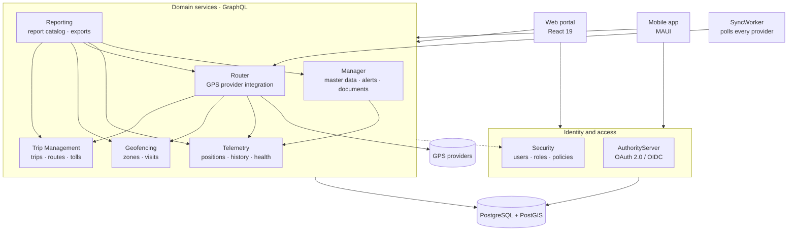

<div align="center">


# TrackHub

**One place for every fleet — whatever GPS platform each vehicle runs on.**

[English](README.md) · [Español](README.es.md)

[](LICENSE)
[](global.json)
[](TrackHub.Portal)
[](TrackHub.Deployment/QUICKSTART.md)
[](https://github.com/shernandezp/TrackHub/actions/workflows/ci.yml)


</div>

---

## What TrackHub is

Most organizations do not buy their GPS hardware from one vendor. They inherit it — a batch of
trackers from one supplier, a second platform that came with a leased fleet, a third that a
subsidiary already paid for. Each one ships its own portal, its own login and its own idea of what
a "trip" is.

**TrackHub is the layer above all of them.** It connects to each GPS provider through a pluggable
provider model, normalizes what they report, and gives the organization one live map, one set of
geofences, one trip board, one report catalog and one permission model over the whole fleet —
regardless of who supplied the hardware.

It is open source, self-hosted, multi-tenant and bilingual (English / Spanish), built as a
.NET 10 GraphQL microservice platform with a React 19 portal.

---

## Highlights

| | |
|---|---|
| **Live tracking** | Real-time map of every transporter and device across all connected providers, with replay and trip segmentation |
| **Multi-provider GPS integration** | One pluggable Router service per protocol, with device management, manual sync, connectivity ping and derived operator health |
| **Geofencing** | Polygon and circle zones on both map providers, PostGIS containment detection, entry / exit / dwell alerts and visit history |
| **Trip management** | Zero-touch trip lifecycle — trips arm, start and complete from origin and stop zones — plus route plans, tolls, proof of delivery, ETAs and public tracking links |
| **Documents & workforce** | Versioned documents with signatures, sharing, expiration and retention; the driver registry with qualifications and assignment history |
| **Alerts & notifications** | Rule-driven alerts delivered in-app, by email, WhatsApp or webhook, with throttling, digests and escalation |
| **Reporting** | A governed catalog of reports with in-app preview and Excel / PDF export |
| **Multi-tenancy** | Account lifecycle, per-account feature flags, branding, and a role + policy permission model enforced service-side |
| **Operability** | A public `/status` page that works without signing in, health checks per service, platform announcements and versioned Docker rollback |

---

## Architecture

Eight backend services, one React portal and a background worker. Every service is Clean
Architecture (Domain → Application → Infrastructure → Web), CQRS over a lightweight custom
mediator, and exposes **GraphQL** — including for service-to-service calls. Authentication is
OAuth 2.0 / OpenID Connect issued by the AuthorityServer; authorization is centralized in the
Security service and enforced by a pipeline behavior in every service.



Full detail in the wiki: **[Architecture](https://github.com/shernandezp/TrackHub/wiki/Architecture)**,
**[Inter-Service Communication](https://github.com/shernandezp/TrackHub/wiki/Inter-Service-Communication)**,
**[Database](https://github.com/shernandezp/TrackHub/wiki/Database)**.

---

## Repository layout

This is a monorepo: every service, the portal, the shared framework, the contract tests and the
deployment tooling live here and build from one solution.

| Module | Purpose | Route prefix |
|---|---|---|
| [TrackHubCommon](TrackHubCommon) | Shared framework (domain, mediator, GraphQL, infrastructure), consumed as a ProjectReference | — |
| [TrackHub.AuthorityServer](TrackHub.AuthorityServer) | Authorization service — OAuth 2.0 / OpenID Connect, login, tokens | `/Identity/` |
| [TrackHubSecurity](TrackHubSecurity) | Security API — users, roles, policies, permissions, service clients | `/Security/` |
| [TrackHub.Manager](TrackHub.Manager) | Management API — accounts, assets, operators, documents, workforce, alerts | `/Manager/` |
| [TrackHubRouter](TrackHubRouter) | Router API and SyncWorker — GPS provider integration | `/Router/` |
| [TrackHub.Telemetry](TrackHub.Telemetry) | Telemetry API — positions, history, operator health | `/Telemetry/` |
| [TrackHub.Geofencing](TrackHub.Geofencing) | Geofencing API — zones, containment detection, visits | `/Geofence/` |
| [TrackHub.TripManagement](TrackHub.TripManagement) | Trip Management API — trips, stops, routes, tolls, public tracking | `/Trip/` |
| [TrackHub.Reporting](TrackHub.Reporting) | Reporting API — governed report catalog, Excel / PDF export | `/Reporting/` |
| [TrackHub.Portal](TrackHub.Portal) | Web portal (React 19 + TypeScript) and the in-app help content | `/` |
| [TrackHub.IntegrationTests](TrackHub.IntegrationTests) | Cross-service GraphQL contract tests | — |
| [TrackHub.Deployment](TrackHub.Deployment) | Docker deployment for the whole stack | — |
| [TrackHubMobile](https://github.com/shernandezp/TrackHubMobile) | Mobile application — **separate repository** | — |

`TrackHubCommon` is referenced by project, not as a local NuGet package: editing shared code and a
consumer is one change, and the compiler reports breakage immediately.

---

## Quick start

### Run the whole stack with Docker

The fastest path to a working installation. Requires a Linux host, Docker, and PostgreSQL 14+ with
PostGIS.

```bash
git clone https://github.com/shernandezp/TrackHub.git /opt/trackhub
cd /opt/trackhub/TrackHub.Deployment
cp .env.example .env      # then edit: domain, database, secrets
./scripts/deploy.sh full --build
```

Follow **[QUICKSTART.md](TrackHub.Deployment/QUICKSTART.md)** end to end for a first installation —
it covers the databases, the PostGIS extension, migrations and OAuth client registration in the
order they have to happen. **[INSTALL.md](TrackHub.Deployment/INSTALL.md)** is the full reference:
configuration keys, SSL, upgrades, backups and troubleshooting.

### Build from source

```bash
git clone https://github.com/shernandezp/TrackHub.git
cd TrackHub

dotnet build TrackHub.slnx          # the whole backend graph
dotnet test  TrackHub.Manager       # or any single service

cd TrackHub.Portal && npm ci && npm run dev
```

Each service also carries its own `.slnx`, so you can work on one service without loading the whole
graph. Every module has its own README with a service-specific quick start.

---

## Technology

| | |
|---|---|
| **Backend** | .NET 10, HotChocolate GraphQL, EF Core + Npgsql, NetTopologySuite, FluentValidation, Serilog, OpenIddict |
| **Frontend** | React 19, TypeScript 7, Vite 8, MUI 9, TanStack Query, Vitest 4, Leaflet / Google Maps |
| **Data** | PostgreSQL 14+ with PostGIS — two databases (`TrackHub`, `TrackHubSecurity`), one schema per service |
| **Integration** | GraphQL everywhere, including service-to-service; OAuth 2.0 client credentials for service identities |
| **Delivery** | Docker Compose behind nginx, GitHub Actions CI, versioned images with one-command rollback |

---

## Documentation

| | |
|---|---|
| **Technical** | The [TrackHub wiki](https://github.com/shernandezp/TrackHub/wiki) — [Architecture](https://github.com/shernandezp/TrackHub/wiki/Architecture), [Technology](https://github.com/shernandezp/TrackHub/wiki/Technology), [Database](https://github.com/shernandezp/TrackHub/wiki/Database), [Security and Identity](https://github.com/shernandezp/TrackHub/wiki/Security-and-Identity), [Frontend](https://github.com/shernandezp/TrackHub/wiki/Frontend), [Testing Strategy](https://github.com/shernandezp/TrackHub/wiki/Testing-Strategy) |
| **Adding a GPS provider** | [Adding a Provider](https://github.com/shernandezp/TrackHub/wiki/Adding-a-Provider) |
| **Deployment & operations** | [Deployment and Operations](https://github.com/shernandezp/TrackHub/wiki/Deployment-and-Operations) · [QUICKSTART](TrackHub.Deployment/QUICKSTART.md) · [INSTALL](TrackHub.Deployment/INSTALL.md) |
| **User documentation** | In the app — the Help button or **F1** on any screen, in English and Spanish |
| **Permissions** | [User Permissions Overview](https://github.com/shernandezp/TrackHub/wiki/User-Permissions-Overview) |

---

## Contributing

TrackHub is built to be extended — new GPS providers, new reports, new integrations. Contributions
are welcome.

- Read [Coding Standards](https://github.com/shernandezp/TrackHub/wiki/Coding-Standards) and
  [Architecture](https://github.com/shernandezp/TrackHub/wiki/Architecture) first — the layering and
  CQRS conventions are enforced consistently across all services.
- Branch from `develop`, keep `dotnet build TrackHub.slnx` green, and add tests beside the code you
  change.
- Open a pull request; CI builds the whole graph and runs the tests for every affected service.

---

## License

Licensed under the **Apache License 2.0** — see [LICENSE](LICENSE).
